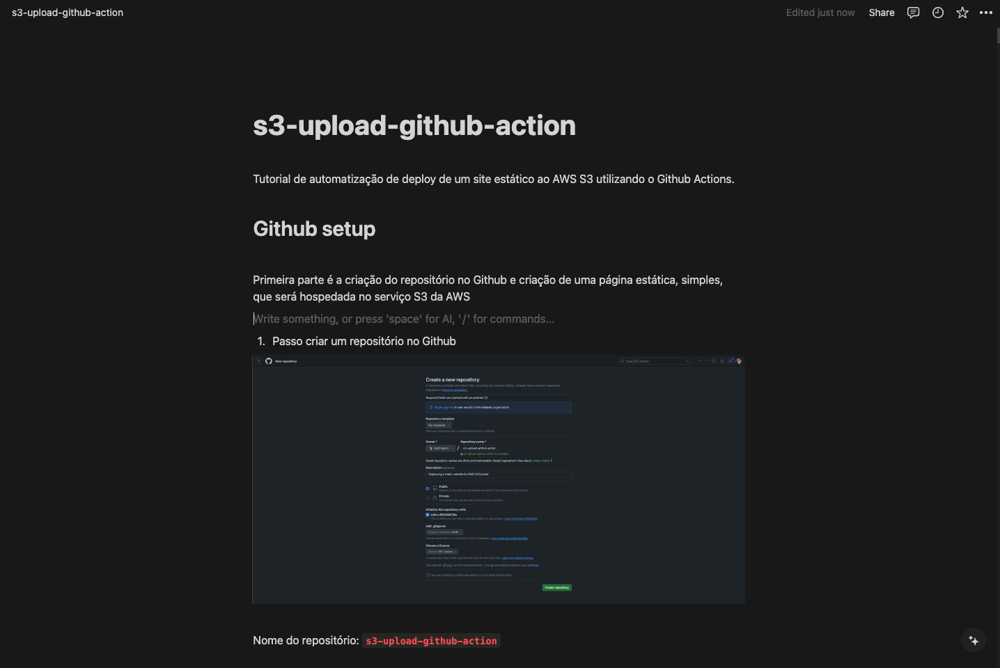

# s3-upload-github-action

Deploying a static website to AWS S3 bucket

  

## 📝 Tutorial link

Contact me on my instagram account [@laisfrigerio](https://github.com/laisfrigerio) to get the Tutorial link ;)

## 👩 Author

| [ <b>@laisfrigerio</b>](https://github.com/laisfrigerio)  |
| :--------------------------------------------------------------------------------------------------------------------------------------------------------------------------------: |

## 📄 License

This project is licensed under the MIT License - see the LICENSE.md file for details
